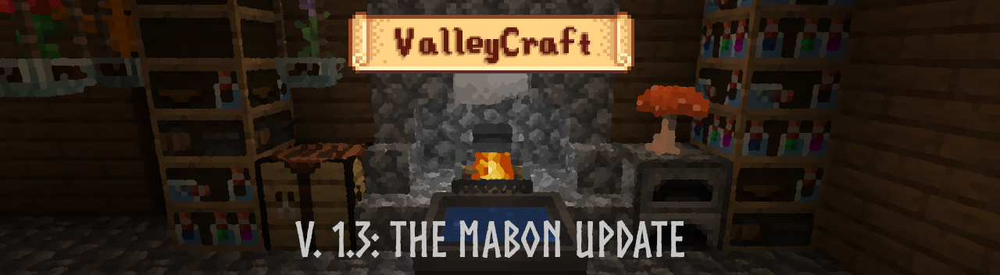
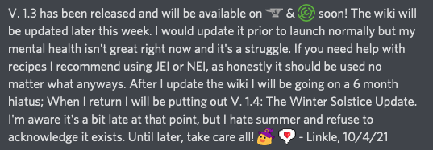

## Welcome to the ValleyCraft wiki!

**ValleyCraft 1.2.1** has finally been released! (Download links are at the bottom of this page)

ValleyCraft is a farming and cooking overhaul mod with a focus on exploration and discovery. It's heavily inspired by Stardew Valley as well as Animal Crossing and Harvest Moon, adding everything from Sickles to Scarecrows and Rope Bridges, as well as over 50 new cooking recipes. Some dishes will even give special effects such as extra hearts or increased strength for a while after eating or drinking them!

Here you will find all the various information you will need for ValleyCraft on Fabric. Click [here](tools.md) to get started from the very beginning!

## Update/Notice!

## Index:

* [Farm Goods & Information](farm_goods.md)
* [Tools & Specialized Equipment](tools.md)
* [Cooking Recipes](cook.md)
* [Rope, Nets, Spike Traps & Rope Bridges](bridges.md)
* [Redstone Lanterns, Hanging Lanterns & Braziers](lights.md)
* [Furniture & Miscellaneous Recipes](misc.md)
* [Exploration, Loot & Gameplay Changes](loot.md)
* [Lingering Powder Addon Guide](potion.md)
* [Update Log](update.md)
* [Mod/Modpacking License](license.md)
* [Attribution/Special Thanks](thanks.md)

## Would you like to suggest a feature or report a bug?
* [Report Bugs](https://github.com/l1nkl3/ValleyCraft-Wiki/issues)
* [Suggest Features](https://github.com/l1nkl3/ValleyCraft-Wiki/issues)

## [Follow me/updates to the mod on Twitter! @LinkleModding](https://twitter.com/LinkleModding)

## Download Links:

* Fabric Launcher: [Website](https://fabricmc.net/use/)
* Fabric API: [CurseForge](https://www.curseforge.com/minecraft/mc-mods/fabric-api/)
* ValleyCraft: [CurseForge](https://www.curseforge.com/minecraft/mc-mods/valleycraft)
* ValleyCraft: [Modrinth](https://modrinth.com/mod/valleycraft)
* Lingering Powder Addon: [CurseForge](https://www.curseforge.com/minecraft/mc-mods/valleycraft-addon-lingering-powder)
* Lingering Powder Addon: [Modrinth](https://modrinth.com/mod/valleycraft-addon-lingering-powder)

## Discord Server: [Click here!](https://discord.gg/kfpmJ5PtnF)

## Don't Forget to add the Fabric API to your mods folder w/ your installation of Fabric!

