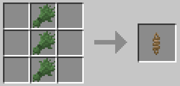

## Rope, Nets, Spike Traps & Rope Bridges

A myriad of equipment useful for climbing, walking across, hanging things, and even tying Leads to! Careful not to fall!

_[Return to Main Page](README.md)_

Ropes: (Can be climbed, walked through, and walked on top of!)

Alternate Fiber Recipes:

Nets: (Prevent fall damage, and can be climbed/walked on!)

Rope Bridge:

Rope Bridge Anchor:

Spike Trap: (Careful! These are incredibly sharp and will make quick work of mobs, you, and any items you hold dear!)

_[Return to Main Page](README.md)_
