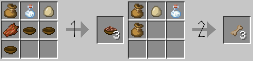

## Cooking Recipes

Everything from Hot Cocoa to Cod Chowder and Sushi await you in this kitchen! I recommend reading through the recipes yourself, so you can learn how to cook everything.
Some food items have special effects, such as a giving you Strength or Fire Resistance for a short time! Careful though! Although the alcoholic items are strong and have positive effects, they also come with some nasty side effects!

_[Return to Main Page](index.md)_

(All are listed in numerical order, from left to right.)

## Teas, Meads, Wines, Juices, & Misc. Drinks

Small Mug, Fern Tea, Bitter Berry Tea, Sweet Berry Tea, Hot Cocoa

Miner's Tea, Dandelion Tea (1.2+)

Mug, Mead, Sweet Berry Cyser, Bitter Berry Cyser, Apple Cyser, Spicy Berry Cyser

Chocolate Cyser (1.2+)

Spicy Berry Wine, Sweet Berry Wine, Chorus Fruit Wine

Bitter Berry Wine (1.2+)

Milk Bottles, Tomato Juice, Apple Juice, Bottle of Pumpkin Soup, Beetroot Juice, Carrot Juice

## Soups & Main Dishes

Pumpkin Soup, Tomato Soup, Bone Broth, Nether Fungus Stew, Carrot Salad, Scrambled Eggs, Raw Egg Bowl, Glow Squid Soup

Rice Bowl, Tropical Fish Salad, Corn Porridge, Beef Stew, Rabbit Bigo, Lamb Biryani, Pork Stir Fry, Seaweed Salad

Cod Chowder, Full Breakfast, Spicy Chicken Curry, Amaranth Pancake Breakfast, Amaranth Porridge, Grub

## Sushi & Bento Boxes

Dried Salmon (as well as Cod & Tropical Fish), Bento Boxes, Salmon Roll, Tropical Roll, Squid Roll, Salmon Roll Bento Box, Squid Bento Box, Tropical Bento Box, Grilled Sucker

## Baked Goods pt. 1 - Doughs

Flour, Dough, Cake Dough, Apple Pie Dough, Pumpkin Pie Dough, Cookie Dough

## Baked Goods pt. 2 - Baked

Cake, Cake Slices, Pumpkin Pie, Apple Pie, Bread, Cookie

## Breakfast Foods

Raw Bacon, Cooked Bacon, Pancake Dough, Bacon Breakfast, Pancake, Bacon & Eggs, Pancake Breakfast, Large Pancake Breakfast (1.2+)

## Misc. Recipes

Crystalized Honey, Honeycomb Chunks, Frozen Slime, Fruit Skewer, Monster Jerky, Golden Fruit Skewer, Cooked Pumpkin Seeds

Stuffed Onions, Baked Apple, Poke Bowl, Miner's Salad, Stuffed Baked Potato, Mushroom Salad, Chocolate Milk (1.2+)

## Wolf Foods! (You can eat these too! ^-^ )

Wolf Kibble, Wolf Biscuits

## Not seeing an item you'd like to cook? Send it to my suggestions inbox!
I'm always looking for more recipes to add, so send me your suggestions! <3

_[Return to Main Page](index.md)_
