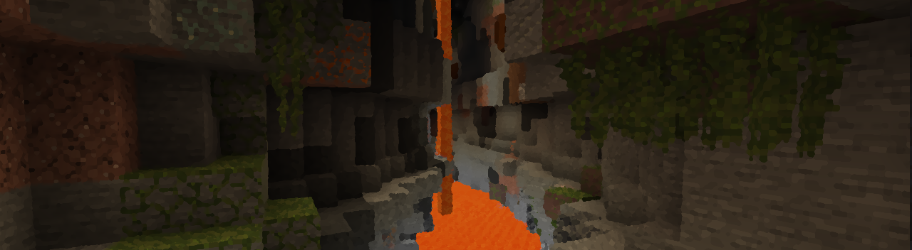
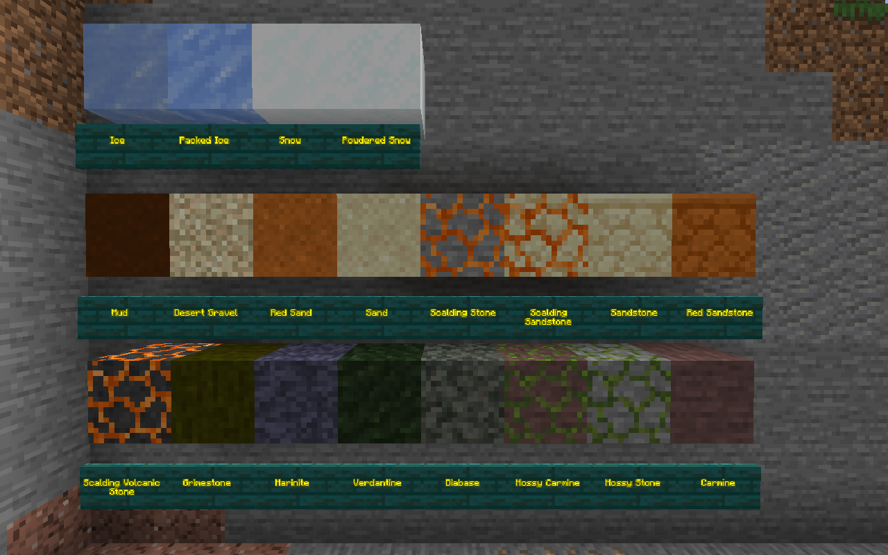

## Exploration, Loot & Gameplay Changes

ValleyCraft adds several new loot items to the mix, so if you don't want any spoilers, turn back now!

_[Return to Main Page](README.md)_

## Mobs

* **Skeletons** and **Strays** will now drop [Arrow Bundles](https://github.com/l1nkl3/ValleyCraftWiki/blob/gh-pages/docs/tools.md) and extremely rarely, Skeleton Skulls.
* **Squids** and **Glow Squids** will now drop 2-4 Squick Suckers, an ingredient used in a number of seafood dishes.

## Chests
* **Jungle Temples** now rarely contain Corn.
* **Bastions** now have Spicy Berries. Careful not to drop them! Piglins love to eat them.
* **Abandoned Mineshafts** now have [Bomb Bags](https://github.com/l1nkl3/ValleyCraftWiki/blob/gh-pages/docs/tools.md), Chains, and Saltpeter on occasion.
* **Shipwrecks** now have Anchors, and Golden Chalices.

## WorldGen
*  **Mud**, **Mixed Ore**, **Scalding Stone**, **Salt Ore**, and **Saltpeter Ore** can now be found in all biomes. (1/2+)
* **Volcanic Ash**, **Volcanic Stone**, **Scalding Volcanic Stone**, **Carmine**, and **Mossy Carmine**, can now be found deep in the heart of jungles. (1/2+)
* **Salt Ore** and **Coal Ore** can now be found throughout the Nether.
* **Small Cacti** and **Tumbleweeds** can now be found in dry biomes, such as deserts and mesas.
* **Desert Gravel, Red Sand, Sand, Scalding Sandstone, Sandstone,** and **Red Sandstone** can be found underground in dry biomes. (1/2+)
* **Fern, Peony, Lilac,** and **Rose Bushes** can be found in their respective biome types that match with their larger counterparts.
* **Tomato Bushes** can be found growing in shattered plateaus.
* **Bitter Berry Bushes** can be found growing in jungles.
* **Wild Crops** can be found growing in [different biomes](farm_goods.md). (1/2+)
* **Ice, Packed Ice, Snow,** and **Powdered Snow** can be found underground in snowy/frozen biomes. (1/2+)
* **Grimestone** can be found underground in Swamps. (1/2+)
* **Marinite** can be found underground in Oceans. (1/2+)
* **Verdantine** can be found in Taiga biomes. (1/2+)
* **Diabase** can be found underground in Dark Forests. (1/2+)

## Mod compatibility info:
For the sake of compatibility with other mods, the following loot tables have been changed:
* abandoned_mineshaft.json (Abandoned Mineshafts)
* bastion_treasure.json (Bastion Strongholds)
* jungle_temple.json (Jungle Temples)
* simple_dungeon.json (The Small Cobblestone Dungeons)
* shipwreck_supply.json (Shipwrecks)

_[Return to Main Page](README.md)_
