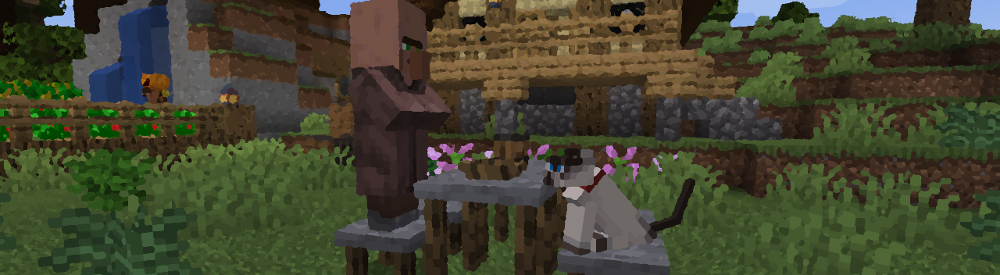
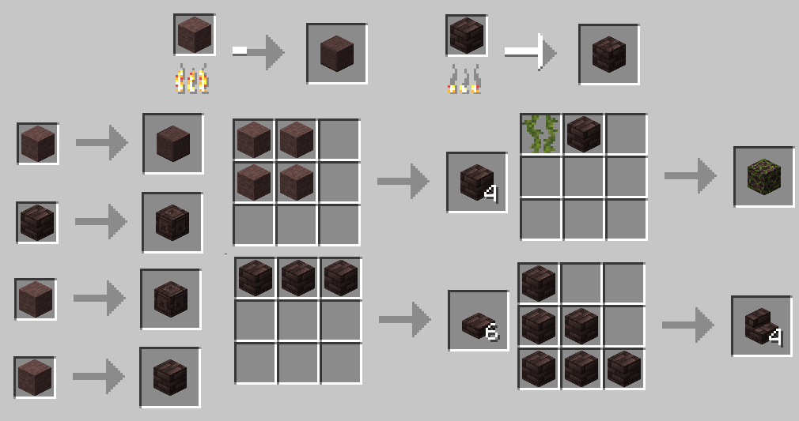

## Furniture & Miscellaneous Recipes

Tables, stools, beveled windows, and more!

_[Return to Main Page](README.md)_

Tables: (All wood types and a stone variant.)

Stools: (All wood types and a stone variant.)

Rounded Barrel:

Beveled Glass:

Fireplace Screens: (Prevent pets from falling into fires!)

Stew Pot:

Campfire Stew Pot:

Chimney: (The inside is climbable!)

Snowy Bush:

Snowy Rocks:

Salt & Charcoal Blocks:

Polished Volcanic Stone, Polished Volcanic Stone (alt. recipe) & Smooth Stone:

New shelf variants for every occasion! Cobweb'ed variants of all the shelves can be made by adding a cobweb.

Crystal Balls that are overflowing with runes are perfect for any witchy occasion.

Carmine can be made into a variety of bricks.

_[Return to Main Page](README.md)_
