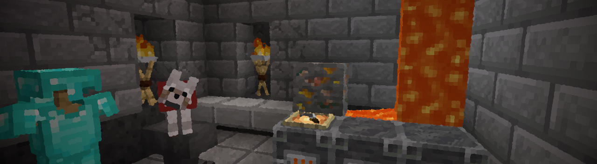

## Tools & Specialized Equipment

ValleyCraft adds a variety of new equipment to aid in exploration and farming back at home. Starting with the first tool you will need, the Knife.

_[Return to Main Page](README.md)_

Knives can be made with any vanilla tool material (i.e. Iron, Stone, et cetera) as well as upgraded to Netherite with a [Smithing Table](https://minecraft.fandom.com/wiki/Smithing_Table) much like any other Diamond gear. Knives cut through Grass and Tall Grass dropping **Plant Fiber**.

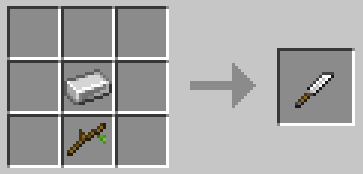

Plant Fiber is used to make **Rope**, a vital item in many recipes such as [**Rope Bridges**, **Spike Traps,** **Nets**,](bridges.md) and [**Braziers**.](lights.md)

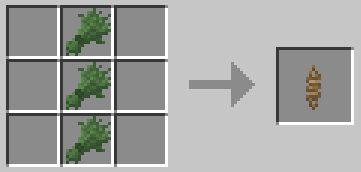

Sickles work like hoes, but they also make a good weapon in a pinch. They swing a bit slower than their counterpart, and deal more damage in return.

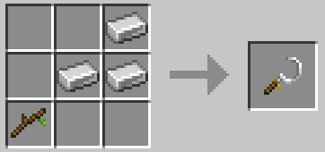

Hatchets, the friendly pocket-sized varient of axes. They swing faster but do a bit less damage.

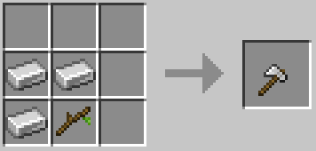

Golden tools can be combined with Copper in a [Smithing Table](https://minecraft.fandom.com/wiki/Smithing_Table) to create Rose Gold Tools! These have the speed of golden tools and the strength and durability of iron.

The Traveler's Sword is made with an Iron Sword and Netherite Scrap. It has 3x the durability of an Iron Sword, 10.5 attack damage, and 1.8 attack speed. However, it's also unenchantable.

Iron Ladders are strong enough to stand on their own, and they can withstand a decent blast!

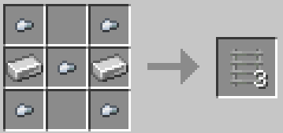

Bamboo Ladders are strong enough to stand on their own too!

Wooden Ladders are strong enough to stand on their own, and they come in all wood variants!

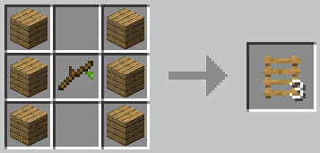

The Lumber Axe has twice the durability of an Iron Axe, but swings slower when attacking.

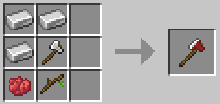

Sharpened Flint can be crafted as an emergency pickaxe in a tight pinch, it has a low durability but it can help you get back above ground if your tools break while mining.

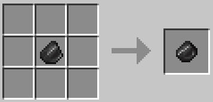

Branches will drop every now and then (half as commonly as apples) while your cutting trees and can make for a quick offensive or defensive measure. They break extremely quickly and do low damage, but it's better than just your fists. They can also be broken down into sticks.

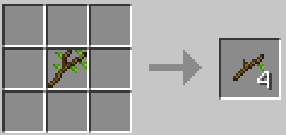

Arrow Bundles are handy when you need to pack light for an adventure but still need a surplus of arrows. Simply right click to break the bundle back down into 8 Arrows. Skeletons and Strays will now on occasion drop them too, as well as their skulls.

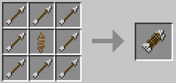

Bomb Bags can be found deep underground in abandoned mineshafts, right clicking them will give you some TNT. Always use with caution.

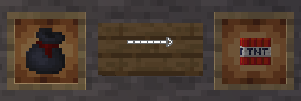

Soup Ladles make for quick cheap shovels, also my brain says it's funny to hit zombies with them, don't ask me why.

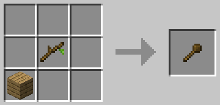

Witch's Wands, Daggers, and Staffs make for effective weapons, and can also magically turn grass into soil.

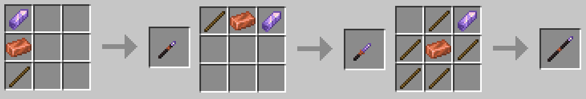

Tongs are used to collect Ice blocks of all types.

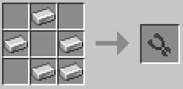

_[Return to Main Page](README.md)_
