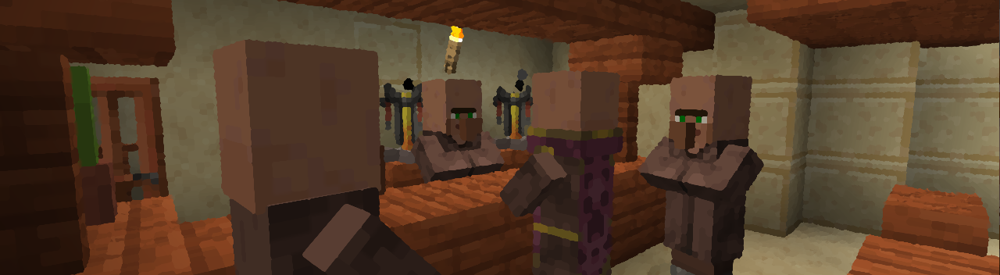

_[Return to Main Page](README.md)_

## Update Log

V. 1.0 - Initial Release
  * Yay :)

V. 1.1 - Release Day Hot Fix
  * Fixed an error that prevented the game from loading.

V. 1.2 - 
  * ***Fixed the stick texture back to vanilla***
  * Fixed the mud block texture
  * Fixed the mud block recipes
  * Fixed the Wooden Sickle recipe
  * Fixed the Saltpeter texture
  * Fixed Branch droprate
  * Fixed the Mod Icon
  * Overhauled worldgen.
  * Added:
     * Rose Gold Tools
     * Traveler's Sword
     * Copper Brazier
     * Campfire Stew Pot
     * Onions
     * Miner's Lettuce
     * Dandelion Puff Balls
     * Wild Potato
     * Wild Carrot
     * Wild Beet
     * Wild Wheat
     * Weaping Swamp Willow
     * Snowy Bush
     * Snowy Rocks
     * Rocks
     * Bush (alive)
     * Bush (tall, alive)
     * Bush (tall, dead)
     * Redwood Sorrel
     * Moss Vines
     * Cattails
     * Blue Poppy Bush
     * Muddy Cattail Roots
     * Carmine Stone (Mossy, Regular, Cobble)
     * Mossy Stone
     * Scalding Stone, Sandstone, Volcanic Stone
     * Desert Gravel
     * Verdantine, Grimestone, Marinite, Diabase
     * Orange Gilled Waxing Cap
     * Verdant Bush
     * Sprout
     * Cobblestone Chimney
     * Dandelion Tea, Miner's Tea, Chocolate Cyser, Chocolate Milk, Bitter Berry Wine, Mushroom Salad, Miner's Salad, Bacon & Eggs, Bacon Breakfast, Pancake Breakfast, Large Pancake Breakfast, Poke Bowl, Pancake Dough, Pancake, Baked Apple, Stuffed Onion, Stuffed Baked Potato, Raw Bacon, Bacon, Wolf Biscuit, Wolf Kibble,

V. 1.2 - 
 *  Fixed food saturation and hunger levels
 *  Fixed ice, snow, packed ice, and blue ice generation in the Ice Spikes
 *  Fixed pickaxe, shovel, flower (item), and flower (block) tags

V. 1.3 The Mabon Update -

 * New items, tools, and terrain generation changes.
 * A Crystal Ball
 * Witch Wand, Staff, and Dagger
 * Tongs for getting ice blocks of all types
 * The start of an achievement panel
 * Lots of new blocks
 * New food recipes
 * New bookshelf variants
 * Amaranth, a new crop that has a purple hue.
 
V. 1.3.1 - 

  *  Fixed all fabric item tags
  *  Carrot Juice has a recipe now
  *  Golden Honeycomb attracts Bees
  *  All new Flowers attract Bees
  *  Piglins are now attracted to all Golden Foods including Glistering Juice.
  *  Snowy Bushes (should) no longer appear in non-snowy cold biomes.
  *  All ore gen such as powdered snow will appear in Ice Spikes biomes properly now.
  *  Puppy Pumpkin Treats are craftable now.
  *  Glistering Juice is also craftable again.

V. 1.3.2. -

  * Fixed the Chiseled Carmine recipe.

_[Return to Main Page](README.md)_
